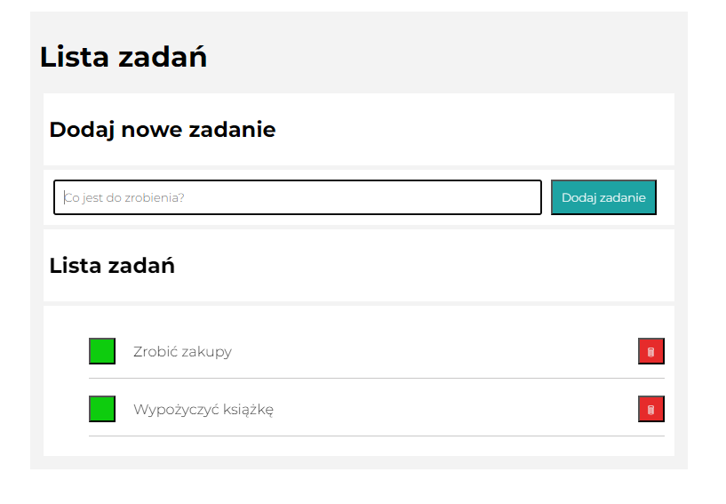

# To Do List

## Demo 
[To do list - Mateusz Woźniak](https://mateuszwozniak97.github.io/to-do-list/)

## Description

This is a simple to-do list application built with HTML, CSS, and JavaScript. The application allows you to create a list of tasks that you need to complete, mark tasks as complete, and remove tasks from the list.

## Features
- Add tasks to the list
- Mark tasks as complete
- Remove tasks from the list

## Getting started
 

To get started with the application, simply click on the link. Application show in your browser window. You can then begin adding tasks to the list by typing them into the input field and pressing enter or button "Dodaj zadanie". To mark a task as complete, click on the checkbox next to the task. To remove a task from the list, click on the "red field with bin" button next to the task.

## Credits
This application was built by Mateusz Woźniak. If you have any questions or feedback, please feel free to contact me at mw54544@gmail.com.